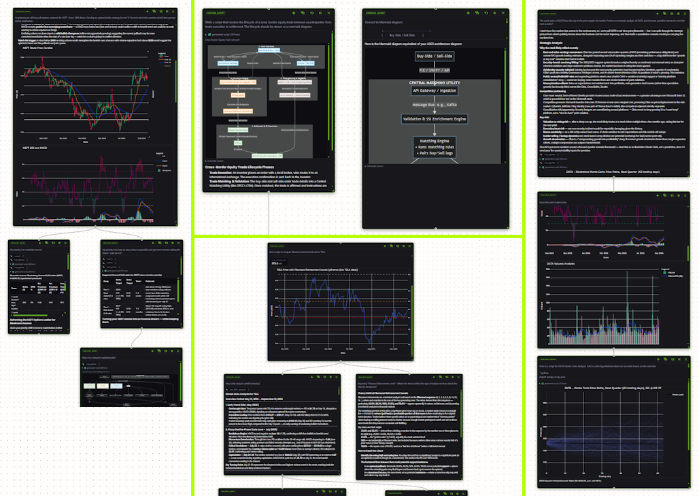

# chat-tree-canvas

A branching-conversation canvas for LLM work, inspired by
[local-lmcanvas](https://github.com/max-lee-dev/local-lmcanvas): each chat is a **tree**
of nodes on an infinite ReactFlow canvas — every node is one (prompt → response)
exchange, and branching from a node forks the full ancestor conversation history instead
of flattening everything into one linear transcript.

The canvas itself is a standalone React package
(`packages/chat-tree-canvas-react/`) hosted by **two independent, interchangeable Python
web apps** that share one framework-free domain-logic core (`chat_tree/`) and one SQLite
file:

- **`app_rx`** — a [Reflex](https://reflex.dev) host.
- **`app_st`** — a [Streamlit](https://streamlit.io) host, wrapping the same canvas as a
  `components.v2` custom component. Responses stream token-by-token into a node live in
  both hosts, including during multi-node cascading reruns.

Both talk to a pluggable chat backend over HTTP/SSE. Two reference-protocol
implementations ship in this repo — a canned demo and a real, LLM-backed agent, see
[below](#try-a-real-agent-without-sandboxed_agents) — and persist to the same session
store, so a session started in one host opens exactly as it left off in the other.



## Docs

- **[Presentation](https://asehmi.github.io/chat-tree-canvas-distro/)** — the intro deck
  and architecture/user-journey diagrams, live via GitHub Pages.
- **[User Guide](_pm/USER_GUIDE.md)** — using the app: what every button does, when it's
  available, and which workflow to reach for.
- **[Build & Install Instructions](_pm/INSTRUCTIONS.md)** — full setup for one or both
  hosts, prerequisites, environment variables.
- **[Blog Post](_pm/BLOG_POST.md)** — the motivation and design principles behind
  treating conversations as trees instead of transcripts, and how the system is put
  together.

## Architecture

```
chat_tree/                        shared framework-free core (both hosts import this,
                                   never a UI framework)
├── providers/                    backend contract + reference implementation
├── api_client.py                 façade over the active provider
├── blocks.py                     stream-event → typed-block reducer (shared by live
                                   streaming AND history replay)
├── context.py                    NodeContext / ConversationContext — ancestor-context
                                   assembly for a rerun/branch prompt
├── tree.py                       graph algorithms: validation, BFS order, tidy layout
├── models.py                     node/edge dict factories + User/Role
├── dag_store.py                  SQLite persistence of tree shape (.db/canvas.db,
                                   shared by both hosts)
├── exporter.py                   chat-tree-canvas/v1 export/import format
└── config.py / utils.py / auth_cookies.py / storage.py

app_rx/                           the Reflex host
├── app_rx.py                     rx.App + page registration
├── states/                       CanvasState / AuthState / ThemeState
├── pages/index.py                full-viewport canvas page + menu bar
└── components/chat_canvas.py     rx.Component wrapper for the npm canvas package

app_st/                           the Streamlit host
├── app.py                        page wiring, canvas fragment, dialogs
├── controller.py                 synchronous counterpart to CanvasState — tree
                                   mutations, live streaming (background thread +
                                   st.fragment), session/export/import
├── auth.py / sidebar.py
└── (consumes chat_tree_canvas_st, see below)

packages/
├── chat-tree-canvas-react/       standalone npm package: ChatCanvas + renderers/,
                                   consumed live (bun-link) by app_rx and built (Vite)
                                   into the Streamlit component by app_st
└── chat-tree-canvas-streamlit/   chat_tree_canvas_st — the Streamlit components.v2
                                   package wrapping the React canvas in a shadow root
```

Rendering a large response mid-stream never re-ships the whole tree: each token push is
a small per-node patch, merged client-side against a cached tree so unrelated nodes keep
their object identity across renders (see the User Guide / blog post for the
user-facing behavior; the streaming architecture itself is Streamlit-components-v2
specific and documented separately for that audience, not duplicated here).

## Quick start

Full setup (prerequisites, environment variables, running one or both hosts) is in
**[INSTRUCTIONS.md](_pm/INSTRUCTIONS.md)**. Short version:

```
.venv\Scripts\activate
pip install -r requirements.txt   # first time

reflex run                        # app_rx, http://localhost:3000
# or
streamlit run app_st/app.py       # app_st, http://localhost:8765
```

Both expect the chat backend on port 8000 (override with `CHAT_API_BASE_URL`); see
INSTRUCTIONS.md for auth setup and building the Streamlit component's frontend bundle.

## Try a real agent without `sandboxed_agents`

`sandboxed_agents` is the author's own real backend. It's not included in this repo —
contact the author for further details if interested — but you don't need it to see the
canvas do everything it's built to do: typed blocks, tool calling, and model-generated
charts/tables/mermaid diagrams, not just streamed text. Two
[reference-protocol](docs/PROVIDERS.md) implementations ship in this repo instead of it:

| | `mock_provider.py` | `insecure_agent_provider.py` |
|---|---|---|
| LLM calls | none — canned responses | real, your choice of provider |
| Tool calling | fakes one `tool_call`/`tool_result` pair | a real agentic loop, real financial-analyst tools |
| Charts/tables/mermaid | canned examples | genuinely generated by the model |
| Code execution | none | **yes — unsandboxed, see below** |
| Clarifying questions | canned example | the model can genuinely ask one (`ask_user`) |
| Needs an API key | no | yes |
| History persistence | in-memory, cleared on restart | local SQLite file, survives a restart |

Use `mock_provider.py` to poke at the UI with zero setup. Use
`insecure_agent_provider.py` when you want the real thing.

Its tools: `validate_ticker` (resolve a name/symbol on its own), `run_full_analysis`
(the real workhorse — fetches OHLCV data via yfinance, or Polygon.io first if
`POLYGON_API_KEY` is set, computes technical indicators, writes a data-driven report,
renders real Plotly stock/RSI-MACD/volume charts, and writes a strategic report
addressing your actual question, all in one atomic server-side call), `search` (news,
DuckDuckGo or Polygon), `ask_user` (a genuine clarifying question — pauses the turn
for your answer), and `run_python` for anything else — ported from `sandboxed_agents`'
own `app/tools/` + `app/agents/` packages, with no access-role gating here: every tool
is available to every user of this provider.

`run_full_analysis` is intentionally one atomic tool rather than separate
scrape/compute/chart tool calls the model would have to chain itself: an LLM asked to
copy a ~250-row market-data blob verbatim between tool calls can silently drop rows or
mangle it, which is exactly what `sandboxed_agents`' own `full_analysis` mode avoids —
its data/technical/financial analyst stages are chained by server-side code, not by the
model reproducing data. This provider now does the same.

**Ask it to write an original script and it will actually try to** — say "write a
script to..." (or prefix your message with `/script`) and the request is classified
before the main turn even starts and sent to the model as a dedicated plain-text
"write me a ```python block" prompt, not as one tool competing for attention among
several others. This mirrors `sandboxed_agents`' own `custom_script` mode, which
never exposes script-writing as a tool call the model has to volunteer for either.

### ⚠️ `insecure_agent_provider.py` runs unsandboxed code — read this first

Its `run_python` tool lets the model write and execute Python with **no
sandboxing of any kind** (`insecure_agent/script_runner.py`): full filesystem,
network, and process access, as whatever account runs the server. That's a deliberate
trade-off — it's a giveaway meant to run anywhere with nothing but a Python
environment, not something with a container runtime behind it — not an oversight, and
not what the real `sandboxed_agents` service does.

Only run it:
- on a machine you fully trust, with nothing sensitive it could reach
- **never** exposed to a network — bind to localhost only, never behind a public URL,
  reverse proxy, or port-forward
- as a throwaway local demo, never anything resembling production

### Setup

```
pip install -r requirements.txt          # pulls in anthropic, google-genai, yfinance,
                                          # plotly, duckduckgo-search, etc.

# .env — pick one provider and set its key
LLM_PROVIDER=anthropic                   # or gemini / openrouter
ANTHROPIC_API_KEY=sk-ant-...
# POLYGON_API_KEY=...                    # optional — unset means yfinance/DuckDuckGo only

.venv\Scripts\uvicorn insecure_agent_provider:app --port 9000
```

Then, same as `mock_provider.py`:

```
# .env
CHAT_API_PROVIDER=reference
CHAT_API_BASE_URL=http://localhost:9000
```

...and restart `reflex run` / the Streamlit app. `LLM_PROVIDER`/`GEMINI_API_KEY`/
`OPENROUTER_API_KEY` and the optional `<PROVIDER>_MODEL` overrides are documented
inline in `.env`.

Chat history is stored locally in `.db/insecure_agent_chat.db` (SQLite, created
automatically on first run) — the same table shape and round semantics
`sandboxed_agents` itself uses against SQLite Cloud, just local instead of cloud.
Delete the file to reset history; session tokens themselves stay in-memory only,
which is fine since the canvas already re-mints its token after a restart.

Every block kind `chat_tree/blocks.py` knows how to render, this backend can
genuinely produce — including `question` blocks, via the `ask_user` tool: when the
model calls it, the round ends right there and the canvas shows the same
answer-and-continue UI as `mock_provider.py`'s canned example.

## Usage

| action                     | how                                           |
| -------------------------- | ---------------------------------------------- |
| new root node               | double-click empty canvas, or "+ New Chat"     |
| send prompt                 | Ctrl+Enter in the node's textarea, or "Send"   |
| branch (fork history)       | ✚ branch button on a completed node            |
| branch from a text selection | select response text, click the floating chip |
| rerun (single or cascade)   | ↻ rerun button, with scope checkboxes          |
| delete node + descendants   | ✕ on the node                                  |
| move / resize node          | drag / resize handle; position persists        |

See the [User Guide](_pm/USER_GUIDE.md) for the complete set of gestures and the five
core usage journeys.

## Not ported (from local-lmcanvas)

Canvas manager (multiple canvases), settings modal, search/command palette, sticky
notes, merge nodes, usage badges, next-step suggestions.
