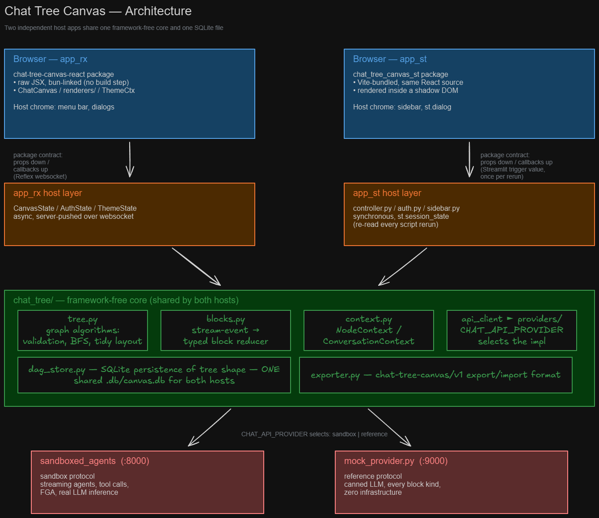

# Chat Tree Canvas: Conversations as Trees, Not Transcripts

*A branching-conversation canvas for LLM work — a standalone React component
(`chat-tree-canvas-react`) hosted by two independent Python web
applications (Reflex and Streamlit), sharing one domain-logic core and a
pluggable chat backend.*

---

## Motivation

Every mainstream LLM interface shares one structural assumption: a conversation is a **list**. You ask, it answers, you ask again — and everything you say permanently colors everything that follows. That shape is wrong for how people actually think when they work with a model:

- **Exploration pollutes context.** You want to ask a tangential "what if?" — but doing so contaminates the thread. The model now carries your detour in every subsequent answer. So you either don't ask, or you open a second chat and lose the shared context entirely.
- **Alternatives can't coexist.** Comparing two framings of the same question means scrolling between chats or overwriting history with "actually, let's try it this way instead." The rejected branch is gone.
- **Revision is destructive.** If an answer three turns back was weak and everything downstream built on it, a linear chat gives you two options: live with it, or start over.
- **Answers are flattened.** Real analytical work produces tables, charts, metrics, and generated code — not just prose. Linear chat UIs render everything as one markdown blob and throw the structure away.

[local-lmcanvas](https://github.com/max-lee-dev/local-lmcanvas) demonstrated the antidote: put the conversation on an infinite canvas as a **tree of message nodes**, and let branching be a first-class gesture. Chat Tree Canvas is a from-scratch reimagining of that idea in Python — because our stack, our agents, and our collaborators live in Python — with several ambitions the original didn't have:

1. **A real agent backend.** Not a local CLI echoing text, but a streaming agent platform (sandboxed code execution, tool calls, retrieval) that emits *typed* results: tables, Plotly charts, metrics, generated scripts.
2. **Multi-user, multi-session persistence.** Auth0 identity, per-user session trees in SQLite, full re-hydration of node content from backend history after any reload.
3. **Backend independence.** The canvas should be a *front end for any chat system* — swapping the backend should be configuration, not a rewrite.
4. **Front-end independence too.** The tree canvas is a general interaction surface, not an application feature. It ships as a standalone React package that any web app can embed — no single application owns it. This is no longer a hopeful claim: the project now runs as two independent host applications, Reflex and Streamlit, built weeks apart, sharing the same canvas package, the same domain logic, and the same SQLite database.
5. **Cascading recomputation.** If a node's answer changes, its descendants are stale. The tree should be able to *re-run itself*.

## Design Principles

### 1. The tree is the source of truth — and it lives on the server

All canvas state — nodes, edges, prompts, streamed blocks — lives in host-side state (`CanvasState` in Reflex, `st.session_state` in Streamlit). The canvas component owns only *transient* UI state: the node being dragged, the textarea being typed into, the text selection in flight. Every mutation flows up through typed callbacks (`onBranchNode`, `onNodeResized`, `onEdgeReconnect`, …) and every render flows down as plain dicts already in ReactFlow's shape.

This one decision buys most of the system's coherence: persistence, export, rerun orchestration, and multi-client consistency are all server-side Python problems, with one carefully-managed exception — the merge rule that never yanks a node out from under a user mid-drag. It also means the principle survives a change of *framework*, not just a change of feature: Reflex holds this state in an async, websocket-pushed server object; Streamlit holds the identical shape in a synchronous, script-rerun-scoped dict. Different execution models, same data, same meaning.

### 2. One core, framework-agnostic — two hosts prove it

`chat_tree/` is a plain Python package with no UI-framework import anywhere in it: the provider contract, the stream-to-blocks reducer, every graph algorithm (link validation, breadth-first traversal, ancestor context-prefixing, tidy layout), SQLite persistence, and the export format. Both hosts call the *same functions* — `app_rx`'s `CanvasState` methods are, almost without exception, one-line delegations into `chat_tree.tree`; `app_st`'s `controller.py` calls the identical functions from plain module-level code operating on `st.session_state` instead of `self`.

The two hosts don't just share logic — they share *data*. Both point at the same `.db/canvas.db`. A tree branched, resized, and rerun in the Reflex app is not exported and re-imported into the Streamlit app to appear there; it's the same session row, read by a different process. That's the sharpest test of "the host owns meaning, the package owns pixels, chat_tree owns everything in between": if any of the three had smuggled in framework-specific behavior, the two hosts would have drifted, and they don't.

What differs between the hosts is exactly what should differ — the orchestration idiom, not the domain logic:

| | Reflex (`app_rx`) | Streamlit (`app_st`) |
|---|---|---|
| State | async server object, pushed over a websocket | synchronous `st.session_state`, re-read on every script rerun |
| Provider calls | `async`/`await` natively | bridged via `asyncio.run()` per call (each session's script runs on its own thread with no ambient loop, so this is safe) |
| Streaming a node | partial blocks pushed into state every ~80ms — the node visibly streams token by token | a background thread owns the SSE stream's event loop; a `st.fragment(run_every=...)` ticks on the script thread and pushes small per-node patches — visibly streams token by token too, via a different mechanism forced by Streamlit's execution model (a script reruns from the top on every interaction; there's no "keep a function running" the way an async Reflex event has) |
| Confirmation dialogs | `rx.alert_dialog` bound to an `open=` state field | `@st.dialog`-decorated functions re-invoked every rerun while a `session_state` flag is set |
| Canvas package consumption | bun-link junction into `.web/node_modules` (raw JSX, no build) | Vite-bundled into a Streamlit components-v2 package, served from a shadow DOM |

None of that difference reaches `chat_tree`. It's entirely contained in each host's own orchestration layer.

### 3. The canvas is a package, not a feature

The visual half of the system is `chat-tree-canvas-react` (`packages/chat-tree-canvas-react/`): a framework-free **controlled React component** with no server logic and no host bindings. Its entire surface is a contract, spelled out in its README:

- **Props down**: `nodes`/`edges` in ReactFlow shape, `mode` (light/dark), a capability flag; **callbacks up**: twelve intent handlers, all optional — omit one and the corresponding UI simply does nothing.
- **Its own theming inputs**: a `theme.css` of semantic variables (`--highlight`, …) that a host can import or replace with its own theme system.
- **Plain npm dependencies** (`reactflow`, `react-markdown`, `remark-gfm`, `plotly.js-dist-min`), React as a peer, raw JSX with no build step.

Crucially, both hosts consume the package **through their own framework's real dependency machinery, not a privileged internal path** — and the two paths look nothing alike, which is exactly the point. Reflex bun-links it as a raw-JSX npm dependency (`chat-tree-canvas-react@link:...`), served straight from source with no build step; Streamlit can't do that, because a components-v2 component must ship as one bundled JS/CSS pair behind a Python entry point, so a second package (`packages/chat-tree-canvas-streamlit/`) Vite-bundles the *same* npm package as one of its own dependencies, wraps it in a `FrontendRenderer`, and exposes it as the pip package `chat-tree-canvas-st`. Two completely different packaging strategies, driven by two completely different host constraints, both consuming the one upstream source. That keeps the portability claim continuously enforced from two independent directions: a change that would break an external host breaks *both* builds first. The division of labor is strict and productive — the package decides how a tree *looks and feels*; the host decides what a tree *means* (validation, persistence, streaming, identity, cost policy).

### 4. A node is one exchange; a conversation is a path

Terminology is load-bearing. A **node** (`node_id`) keys exactly one prompt/answer exchange. A **conversation** is a full root-to-leaf path through the tree. The backend doesn't know the tree exists — each node is an independent exchange on the wire (the backend still calls the key `conversation_id`; that rename is deferred).

This split resolves the tension between tree UIs and linear chat APIs: the tree is a UI/orchestration concept, the exchange is the wire concept, and the mapping between them is explicit and documented rather than smeared across the codebase.

One consequence of "exactly one prompt/answer exchange" is enforced in the UI, not just the data model: a node's prompt is editable only until first submit. Once a node has streamed a response, its prompt becomes read-only — there's no in-place edit. To ask a *different* wording, you Duplicate the node (a fresh `node_id`, same parent, prompt pre-filled and editable, response empty) and send from there; Rerun re-asks the identical wording, it never lets you change it while reusing the exchange. It would be easy to bolt an in-place prompt edit onto a completed node — the textarea is right there — but it would break the one invariant everything else in this design leans on: a `node_id`'s prompt and its answer always describe the same exchange. Edit a completed node's prompt without a fresh exchange, and the backend history (keyed on that `node_id`) and the canvas would disagree about what was actually asked — every downstream `ConversationContext`, every export, every rehydration-from-history would be reading a lie. Duplicate-then-edit costs one extra click; it buys back a guarantee the rest of the system depends on.

### 5. Context travels inside the message — as a postfix, not a prefix

How does node D, three levels deep, know what A, B, and C said? Not by server-side conversation threading, and deliberately not by the usual user/assistant turn format either. `chat_tree.context` builds the outgoing message as two typed pieces — `NodeContext` (one node's prompt/response pair) and `ConversationContext` (the node about to run plus its ancestor chain) — and flattens them, in one explicit method (`ConversationContext.to_prompt()`), into: the current prompt *first*, then, only if there's history, a `--- HISTORICAL CONTEXT (latest first) ---` delimiter followed by ancestor answers (markdown text only, tables and charts redacted to one-line notes) ordered **latest ancestor first**, `---`-separated, truncated under a character budget from the tail — so the oldest (root) is what gets dropped first, since it's now at the end instead of the start.

Prompt-first is the load-bearing choice: the backend's intent/route classifier reads whatever comes first, and burying today's actual question under several paragraphs of upstream history was quietly biasing it. Putting the prompt at the top and demoting history to a clearly-labeled postfix keeps classification honest without losing the context downstream turns still need.

The cost is token duplication on deep trees. The payoff is that *any* backend that accepts a message and streams a reply can power the canvas — the backend needs zero knowledge of branching, and branches can never contaminate each other because there is no shared server-side thread to pollute.

### 6. Answers are typed blocks, not markdown blobs

A response is a list of typed blocks mirroring the backend's stream events:

```
{"kind": "text",   ...}   markdown prose
{"kind": "tool",   ...}   tool-call status line
{"kind": "script", ...}   collapsible generated code
{"kind": "metric", ...}   stat tile
{"kind": "table",  ...}   scrollable records table
{"kind": "chart",  ...}   Plotly figure
{"kind": "mermaid", ...}  diagram/flowchart, rendered from mermaid source
{"kind": "question", ...} pauses the turn for user input (see §12)
```

One Python reducer (`apply_event_to_blocks`) folds stream events into blocks — and the same reducer replays persisted events during hydration, so live streaming and reload-from-history render identically by construction. On the front end, the package's **renderer registry** (`chat-tree-canvas-react/src/renderers/`, one file per kind, dispatched on `block.kind`) draws them; unknown kinds are skipped, so newer backends degrade gracefully on older front ends. Adding a custom kind is a documented three-touch change: emit the event, add a reducer case, register a renderer (`docs/RENDERERS.md`) — and a host can extend `RENDERERS` without forking the package.

### 7. The backend is a contract, not a dependency

All backend traffic flows through a provider interface (`chat_tree/providers/`): health check, per-identity session tokens, per-node history, round deletion, and an event stream. `CHAT_API_PROVIDER` selects the implementation at startup.

One provider ships built-in: `reference` — a deliberately minimal HTTP protocol (five endpoints, SSE streaming, minimum viable stream = `text_delta`* + `done`). `mock_provider.py` is a complete FastAPI implementation of it with a canned LLM that exercises every block kind, and `insecure_agent_provider.py` is a real, LLM-backed one — collaborators can run the entire canvas with zero real infrastructure, then swap in their own backend by implementing five endpoints (`docs/PROVIDERS.md`).

Symmetry is the point: the system is **open at both ends**. The provider contract decouples it from any particular chat backend; the package contract decouples it from any particular web front end. What remains in the middle — a host's orchestration layer, whichever framework it's written in — is precisely the logic that gives a tree its meaning.

### 8. Reruns are cascades — a dial, not a switch

The rerun button doesn't have to just re-ask one node. By default it walks the subtree **breadth-first**: delete the node's exchange server-side, re-stream it, then re-run each descendant in turn — so every child rebuilds its `ConversationContext` from its ancestors' *fresh* answers. A failed node prunes its own branch; sibling branches continue. A toolbar chip reports progress ("Rerunning 3 of 7…").

That default is right most of the time, but it quietly bundles two separate questions into one button: *how far does this rerun reach*, and *what context does each rerun see*. The confirmation dialog now exposes both as independent checkboxes, both on by default so the original unconditional behavior is still one click away:

- **Apply to descendants** — cascade breadth-first (the original behavior) vs. touch only the node you clicked. Off, you can fix one wrong answer mid-tree without paying to re-stream a wide subtree underneath it.
- **Include ancestors as context** — prefix every rerun prompt with its ancestor chain's answers (the original behavior) vs. send each prompt exactly as written, with no prefix at all. Off, you can tell whether a bad answer was the model's fault or the *context's* fault — same wording, run cold.

The two are independent, so all four combinations are meaningful: cascade with fresh context is a real "what-if," cascade without context is a blast-radius check on the raw prompts alone, ancestors-only-no-cascade is a targeted context refresh, and neither is just "run this one prompt exactly as written, right now." Because cascades on deep, wide trees are still token-expensive, the coarser gate stays underneath the checkboxes: `CASCADING_RERUNS=false` restricts Rerun/Duplicate to leaf nodes in the first place, where "Apply to descendants" has nothing to reach anyway. Cost controls are configuration, not code archaeology — the checkboxes are just a finer dial on top of it.

### 9. Shape and content have different owners

SQLite (`.db/canvas.db`) persists only the tree's *shape*: sessions, node positions and sizes, prompts, edges — tenanted by user. Node *content* is never stored locally; it re-hydrates from the backend's per-node history on load. If history is gone (pruned backend, imported file from elsewhere), nodes degrade to prompt-only with a single warning toast — rerun to regenerate. One copy of the truth per concern, and deleting backend data can never corrupt the canvas, only empty it.

### 10. Portability is a file format

Export produces one JSON document (`chat-tree-canvas/v1`, `chat_tree/exporter.py`) with two views of the same session: the exact canvas (nodes + geometry + edges) for canvas-to-canvas restore, and **coalesced conversations** — every root-to-leaf path flattened into a user/assistant message list with deterministic conversation IDs and `node_id` kept on every message (so the tree is losslessly recoverable from the flat form). The same file serves the canvas importer, a future backend-DB importer, and any downstream chat system that only understands linear dialogues.

### 11. Theming is a variable cascade — with its own namespace

The Performance theme defines semantic CSS variables (`--primary`, `--highlight`, `--dim`, …) per `light`/`dark` body class, and app_rx's Tailwind utilities consume them directly. The packaged canvas does *not* read those same generic names, though — its public contract is a `--ctc-`-prefixed set (`--ctc-highlight`, `--ctc-dark`, …), defined in the package's own `theme.css`. The prefix exists because this is a package meant to be dropped into an arbitrary host, and `--primary`/`--highlight`/`--dark` are exactly the kind of generic names a host's own design system is likely to already own — a package that assumed it could claim them outright would silently collide the moment it met a host with an opinion of its own. A host maps its tokens onto the contract instead of the reverse: `assets/css/canvas-bridge.css` — a small file dedicated to exactly this, separate from `themes.css` itself — aliases app_rx's own variables onto the `--ctc-*` set (`--ctc-highlight: var(--highlight);`, one line per token, in both mode blocks) rather than defining a second, independent set of literals that could drift out of sync with the first.

Inside ReactFlow — which aggressively memoizes nodes — the active palette travels through a React context, because context updates pierce memoization where props don't. A mode toggle re-skins every node, edge, scrollbar, and minimap live, and persists via localStorage. Streamlit's shadow-DOM host can't use the alias trick at all — `:root`-scoped custom properties don't cross a shadow boundary — so `chat-tree-canvas-streamlit`'s `THEME_VARS` mirrors the same `--ctc-*` names as a plain JS object, set inline on the shadow root's wrapper element per mode.

### 12. A follow-up is a branch, not a resumption

Some agent turns can't be finished without more information from the user — a missing parameter, a preference, a clarifying detail the agent has no business guessing. The backend can end a turn with a `question` result instead of a final answer (a fifth `tool_call_result` kind, alongside markdown/metric/table/chart — no new event type; an agent invoking an `ask_user` tool just ends the round with this kind rather than continuing to reason, and it's reserved for genuine blockers, not lightweight yes/no approvals, which already have their own `denied` tool-result path). The canvas renders it inline as a small input, right where the rest of the answer would otherwise be.

The interesting decision is what happens when you answer it. The obvious move — resume the same node, feed the answer back into the same exchange — was rejected for the same reason principle #4 rejects in-place prompt edits: it would mean a `node_id`'s prompt and its answer no longer describe one exchange, and it would require the backend to hold open agent-reasoning state across a client round-trip, which nothing else in this system does — every other rerun starts a genuinely fresh backend call. Instead, answering creates a **new child node**, same mechanism as any other branch, whose prompt is the composed exchange itself (`Agent asked: {question}. User responded with: {answer}.`), auto-submitted with the asking node's full ancestor context already flowing in for free — because that's what a plain child node always gets. A question isn't a special interaction; it's branching with a pre-filled, auto-sent prompt.

That framing pays for itself twice. First, nothing new had to be taught to the rest of the system — persistence, rerun, export, cascading reruns all already know how to handle "a node with a prompt and a parent." Second, it composes cleanly with principle #1: whether a question has been answered is never stored as a flag on the block — it's derived, at render time, from whether the asking node has a child whose prompt matches. If that node is later rerun and its new response doesn't repeat the same question, the resolved display just reverts to an interactive one — not a bug, the same accepted staleness a quoted branch-from-selection node already has if the node it quoted is later rerun. The tree is still the only source of truth; a question is just another shape a node's content can take.

## Architecture



The component and its host meet at exactly one seam — the package contract — and each host wires that seam through its own idiom: Reflex over a websocket (props from Python state, callbacks as Reflex events), Streamlit through a transient trigger value returned once per script rerun and dispatched by `controller.handle_event`. Nothing above the seam knows about Reflex or Streamlit; nothing below it knows about ReactFlow. Both hosts then converge on the exact same `chat_tree` core and the exact same SQLite file — the fan-in in the diagram is not a simplification, it's the actual data flow.

**A prompt's life (Reflex):** the user types into a node and hits Send → `onSubmitPrompt` reaches `submit_prompt`, which persists the prompt, builds the outgoing message via `ConversationContext.build(...).to_prompt()`, and opens the provider stream → each SSE event folds through the reducer into typed blocks, throttled state pushes animate the node live → `done` records the round number → the node is `complete`, and its answer is now context for any children.

**The same prompt's life (Streamlit):** identical persistence and context-prefix step, then the whole method blocks inside a `st.status("Thinking…")` spinner while the same reducer folds the same stream — the difference is *when* the UI sees it: one push at the very end instead of every ~80ms. Same reducer, same blocks, same resulting node — just a coarser update cadence, which is the one place the two hosts' user experience visibly diverges.

**A reload's life:** `on_load` (Reflex) / `ensure_loaded` (Streamlit) resolves identity (Auth0 email or dev fallback) → loads the latest session's shape from SQLite → fetches each node's history from the backend → replays stored events through the same reducer → warns once about any nodes whose content no longer exists.

**Key interactions:** branch (✚, or Ctrl+B, or *select text in an answer* to branch quoting that phrase), answer an inline follow-up question (creates and auto-submits a new child node with the composed exchange as its prompt), duplicate a prompt into a fresh exchange (the only way to change its wording), rerun (⟲, with independent apply-to-descendants / include-ancestors-context checkboxes), copy a response to the clipboard (⎘), delete subtree, drag-rewire edges with cycle/single-parent validation, resize nodes (charts and tables scale their height with width), Tidy Tree auto-layout (depth rows, children centered under parents, anchored so the viewport doesn't jump), session picker, JSON export/import.

## Use Cases

**Exploratory research.** One root question, one branch per hypothesis. Each branch inherits the shared context but explores independently — no cross-contamination, all alternatives visible side by side, the tree itself a record of the investigation.

**Prompt engineering.** Duplicate a node to re-ask the *same* prompt in the same context under a fresh exchange, or branch to vary the phrasing. Compare answers spatially. Export the session and hand a collaborator the exact tree that produced the winning variant.

**Data analysis with agent backends.** Against a real agent backend like `insecure_agent_provider.py`, nodes stream tool calls, generated Python, metrics, tables, live Plotly charts, and mermaid diagrams. An analysis session becomes a canvas of linked, resizable dashboards, where each chart's or diagram's provenance — the conversation that produced it — is one glance up the tree.

**Guided data-gathering.** An agent that's missing a parameter — a date range, a threshold, a risk tolerance — asks for it inline instead of guessing or stalling; the answer becomes a real branch in the tree, so the exact information exchange that unblocked the analysis stays visible later instead of disappearing into a side-channel.

**What-if recomputation.** Clear and re-run a mid-tree node whose framing was wrong; by default the cascade re-answers every descendant against the corrected context, breadth-first, with progress reported — or scope it down to just that node if the fix shouldn't ripple. The tree behaves like a spreadsheet where upstream cells are prompts.

**Teaching and demos.** The mock provider makes the whole system runnable on a laptop with no LLM, no keys, and no cost — while exercising every renderer. It doubles as the executable specification for backend integrators.

**Same tree, either front end.** Because both hosts share one SQLite file, a session started in the Reflex app is browsable and editable from the Streamlit app on the next load, and vice versa — no export/import round trip, just two windows onto the same rows. Handy on its own (branch a tricky conversation in one UI, hand the session ID to a colleague running the other), but its real value is as a running integration test: if the two hosts ever silently disagreed about what a node or an edge means, this is where it would show up first.

**Embedding the canvas elsewhere.** Because the UI is a package, the tree surface can be dropped into an existing product — an internal analytics portal, a Next.js dashboard, an Electron app — by installing `chat-tree-canvas-react` (or wrapping it the way `chat-tree-canvas-st` does, for frameworks that need a bundled component) and implementing its callbacks against that product's own state and APIs. This is no longer a design aspiration verified by one example: it's now demonstrated twice, by two hosts with almost nothing in common at the framework level. The package README is the integration contract; `app_rx` and `app_st` are both reference hosts, not the canonical one.

**Team integration at the back end.** Symmetrically, teams keep this app's UI and point it at their own chat infrastructure: implement the five-endpoint reference protocol (or a `ChatProvider` subclass for exotic wire formats) and add domain-specific block kinds (gauges, maps, diffs) with one renderer file and one reducer case (`docs/PROVIDERS.md`, `docs/RENDERERS.md`).

## What's Next

- **Stop button** for in-flight streams (cancellation flag checked between events) — both hosts stream live now, so both would benefit equally from being able to interrupt mid-call.
- **Sandbox-side importer** for the v1 export format — each coalesced conversation becomes a multi-round backend conversation — together with the backend's `session_id → conversation_id` rename.
- **Round-trip hardening**: browser-level tests of export → import → re-hydrate, on both hosts.
- **A third host** — a minimal Next.js or Vite app driving the canvas directly (no Python framework at all) would test the package contract from the side neither current host exercises: a host with no server-side state model of its own to adapt.
- Node conveniences: collapse-to-prompt, search/jump-to-node.

---

*Stack: the `chat-tree-canvas-react` package (React 18, ReactFlow 11, Plotly), hosted by Reflex 0.8 (`app_rx`) and Streamlit 1.58 via a components-v2 wrapper, `chat-tree-canvas-st` (`app_st`); one shared `chat_tree` core; SQLite for tree shape; Auth0 identity; FastAPI mock provider. Tree shape persisted per user; content owned by the chat backend; the canvas owned by no one host — everything in between is a contract.*
