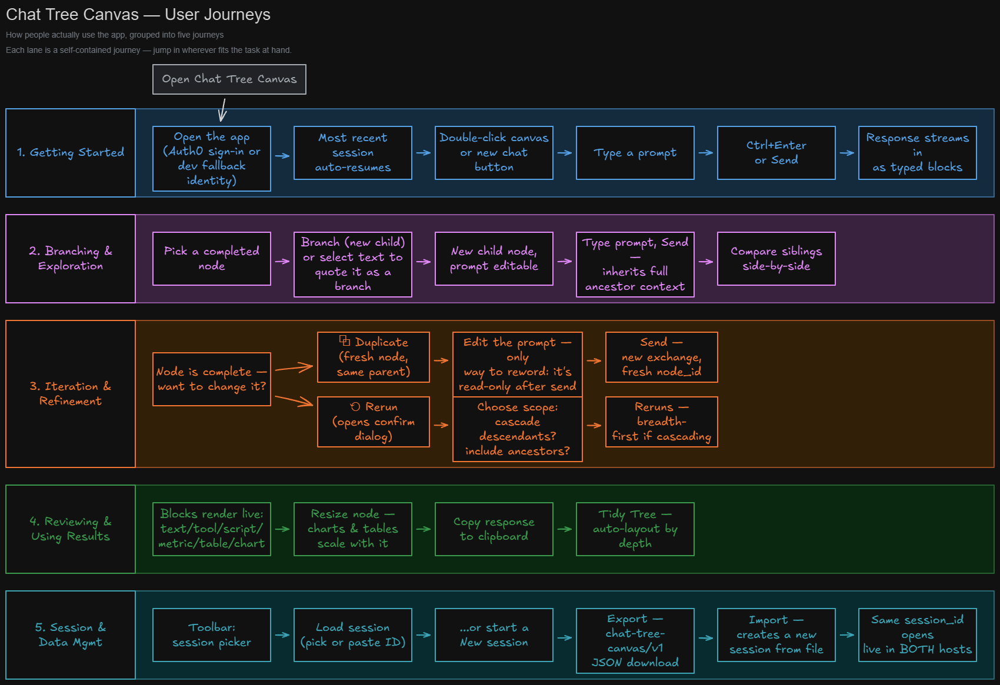

# Chat Tree Canvas — User Guide

A practical guide to *using* the app: what every button does, when it's
available, and which of the five journeys below to reach for. For *why* the
app is shaped this way, see `BLOG_POST.md`; for the system's internals, see
`chat_tree_canvas_architecture_v1.png`; for build/install, see
`INSTRUCTIONS.md`. This guide assumes the app is already running (either
host — the UI concepts below are identical, only the chrome around the
canvas differs).

The map above is the fast reference. Everything below expands each lane
with the detail the diagram doesn't have room for.

---

## Core concepts (read this first)

- **A node is one prompt/answer exchange**, not a whole conversation. It has
  exactly one prompt and, once run, exactly one answer.
- **A conversation is a root-to-leaf path** through the tree. Branching
  forks that path; every node below a branch point inherits everything
  above it as context.
- **A node's prompt is read-only once it has been submitted.** There is no
  in-place edit. This is deliberate (see journey 3) — it's what guarantees
  a node's prompt and its answer always describe the same exchange.
- **Node status** drives what's visible on it:
  | Status | Meaning | What you see |
  |---|---|---|
  | `idle` | never submitted | editable textarea + Send button, header says "new prompt" |
  | `streaming` | answer is arriving | pulsing border, "thinking…" label, blocks fill in live |
  | `complete` | answer finished cleanly | full action set (branch, duplicate, rerun, copy, delete); a route chip if the backend reported one |
  | `error` | the exchange failed | red border, error message; duplicate/rerun available to retry, but **not** branch — there's nothing to build on |
- **The tree persists automatically** (position, size, prompts, edges) —
  there's no save button. Answer *content* is never stored locally; it's
  re-fetched from the backend's history on load, so if backend history is
  gone (pruned, or a session imported from elsewhere) affected nodes
  degrade to prompt-only with a one-time warning. Rerun to regenerate.

---

## 1. Getting Started

Open the app → sign in (or the dev-fallback identity picks you up
automatically if Auth0 isn't configured) → your most recent session loads
by itself. From there:

- **New root node**: double-click empty canvas space, or click **+ New
  Chat** in the toolbar/sidebar (places a root node without needing to
  click a specific spot).
- **Type a prompt** in the node's textarea.
- **Some backends pick a response mode for you** — `insecure_agent_provider.py`,
  for example, first runs a cheap LLM classification call to decide whether
  your message wants a script written and run, or a normal answer (shown
  afterward as the route chip in the node header). It's usually right, but
  you can skip classification and force the script path by starting the
  prompt with `/script`.
- **Submit**: `Ctrl`/`Cmd`+`Enter`, or the **Send** button.
- The node streams into `streaming` status, then settles into `complete`
  (or `error`) once the backend's `done` event arrives — both hosts show it
  filling in token by token as it streams, not just at the end.

## 2. Branching & Exploration

Once a node is `complete`, two ways to fork it:

- **✚ Branch** — creates a new, empty child node under it. Type a fresh
  prompt and send; it inherits the full ancestor chain as context (see
  journey 3 for exactly how that context is assembled).
- **Branch from selection** — select text inside a completed node's
  answer; a **✚ Branch from selection** chip appears near the bottom of
  the node. Click it to create a child node whose prompt quotes the
  selected text verbatim, ready for you to extend.

Either way, siblings sit side by side on the canvas — you can compare two
framings of the same question, or two follow-ups, without either one
polluting the other's context. Nothing you branch into ever mutates the
node you branched from.

## 3. Iteration & Refinement

This is the journey worth understanding in depth, because it's the answer
to "how do I change something I already asked."

**There is no in-place prompt edit.** A node's prompt is only editable
while it's `idle` (never submitted). Once it has an answer, the prompt
becomes read-only text. This isn't a missing feature — it's what keeps a
node's prompt and its answer permanently in sync with each other and with
the backend's history for that exchange. Two different actions cover the
two different things people actually mean by "change it":

### Want different wording? → Duplicate

**⧉ Duplicate** copies the prompt into a **fresh node** (new `node_id`)
under the same parent, response cleared, prompt editable. Edit the text,
hit Send — it runs as a brand-new exchange. Use this to try a different
phrasing, or to re-ask the same question under a different parent by
dragging the duplicate to reconnect it.

### Want to re-run what's already there? → Rerun

**⟲ Rerun** deletes the node's current answer server-side and re-asks the
*same* prompt — you can't edit the wording here, only how the rerun
behaves. It opens a confirmation dialog with two independent checkboxes,
both **on by default**:

| Apply to descendants | Include ancestors as context | What happens |
|---|---|---|
| ✅ | ✅ | *(default)* Cascades breadth-first to every descendant; each node reruns against its **refreshed** ancestor context. The standard "fix an upstream mistake and let it ripple down" move. |
| ✅ | ☐ | Cascades to every descendant, but each one runs with **no ancestor context** — raw prompts only. A blast-radius check on the prompts themselves, decoupled from context. |
| ☐ | ✅ | Only **this** node reruns, with fresh ancestor context. Descendants are untouched. Cheaper than a full cascade when you just need one node caught up. |
| ☐ | ☐ | Only this node reruns, prompt exactly as written, no context at all. The literal "just ask it again, cold" option — useful for isolating whether a bad answer was the model's fault or the context's fault. |

A progress chip ("Rerunning 3 of 7…") tracks a cascade while it runs. A
node that fails prunes its own branch; sibling branches keep going.

> Under the hood, ancestor context isn't prepended the way you'd expect
> from a normal chat thread — it's **postfixed**, prompt first, so the
> backend's intent classifier always sees the actual question before any
> history. See `BLOG_POST.md` §5 if you're curious.

Rerun and Duplicate only appear on `complete`/`error` nodes, and — unless
the deployment has `CASCADING_RERUNS=true` — only on **leaf** nodes (no
children), since rerunning a mid-tree node is what triggers a cascade in
the first place.

## 4. Reviewing & Using Results

Answers render as a sequence of **typed blocks**, not one markdown blob:

| Kind | What it renders |
|---|---|
| `text` | Markdown prose (headings, lists, code fences, tables, links) |
| `tool` | A tool-call status line: called → ok / denied, with a reason |
| `script` | A collapsible block of generated code |
| `metric` | A single stat tile (label / value / unit) |
| `table` | A scrollable records table |
| `chart` | A live Plotly figure |
| `mermaid` | A diagram or flowchart, rendered from mermaid source |
| `question` | An inline follow-up prompt from the agent, with an answer box — see "Answering a follow-up question" below |

### Answering a follow-up question

Occasionally an answer isn't finished — the agent needs one more piece of
information from you before it can proceed (a date range, a preference, a
missing parameter) and pauses instead of guessing. That shows up as a
`question` block: the agent's question, plus a small answer box right there
in the response.

Type your answer and submit it (same `Ctrl`/`Cmd`+`Enter` convention as
everywhere else). This does **not** rerun the node that asked — it creates
a **new child node** underneath it, same as Branch, with the exchange
(`Agent asked: … User responded with: …`) as its prompt, sent
automatically. The new node streams in with the asking node's full context
already included, exactly as any child would.

Once answered, the question in the parent's response is replaced by that
same composed line — a plain statement of what was asked and answered, not
an editable box anymore. If you rerun the parent later and its new answer
doesn't ask the same thing, that resolved line quietly reverts to an open
question — expected, not a bug (same as a quoted branch-from-selection node
going stale if the node it quoted is later rerun).

Practical actions once a node has content:

- **Resize** by dragging the node's edges/corner — charts and tables scale
  their height with the node's width, so widen a node to read a dense
  table or chart comfortably.
- **⎘ Copy response** — copies the answer's text to your clipboard in one
  click (text kept verbatim; tables/charts reduced to a short note, same
  reduction used when that node's answer becomes ancestor context for a
  child). The icon flips to a checkmark briefly to confirm.
- **Tidy Tree** (toolbar/sidebar) — auto-layout: one row per depth,
  children centered under their parent, anchored so your current viewport
  doesn't jump. Handy after a lot of branching has left the canvas messy.

## 5. Session & Data Management

- **Session picker** (toolbar's **Load Session…** / sidebar's same) —
  click a row to load that session's tree, or paste a session ID directly.
  Node *content* re-hydrates from backend history on load; if some is
  gone, you'll get a one-time warning listing how many nodes were
  affected.
- **New Session** — starts a blank canvas under a fresh session ID. Your
  previous session isn't deleted, just no longer the active one.
- **Export Session** — downloads a `chat-tree-{sessionId}.json` file in
  the `chat-tree-canvas/v1` format: the exact canvas (nodes, positions,
  edges) plus every root-to-leaf path coalesced into a flat
  user/assistant conversation, for handing to something that only
  understands linear chat.
- **Import Session…** — upload a previous export; it becomes a **new**
  session (never overwrites your current one). Node IDs are kept verbatim,
  so if you're importing into the same backend that produced the export,
  answers re-hydrate in full; otherwise nodes degrade to prompt-only, same
  as any other missing-history case.
- **Same session, either host** — both hosts read and write the exact same
  SQLite row. Load a session ID in the Reflex app, then open the same ID
  in the Streamlit app (or vice versa) — it's the same tree, live, not a
  copy. Handy for handing a session ID to a colleague running the other
  host.

---

## Node action quick reference

| Icon | Action | Visible when |
|---|---|---|
| ✚ | Branch | node is `complete` |
| *(text selection)* | Branch from selection | text selected inside a `complete` node's answer |
| ⧉ | Duplicate | `complete`/`error`, and (leaf node **or** `CASCADING_RERUNS=true`) |
| ⟲ | Rerun | `complete`/`error`, and (leaf node **or** `CASCADING_RERUNS=true`) |
| ⎘ / ✓ | Copy response | not streaming, and the node has at least one response block |
| ✕ | Delete (node + descendants) | always |

## Keyboard shortcuts

| Shortcut | Effect |
|---|---|
| `Ctrl`/`Cmd` + `Enter` | Submit the focused node's prompt |
| `Ctrl`/`Cmd` + `B` | Branch the currently selected node |
| `Delete` / `Backspace` | Delete the currently selected node (opens the confirm dialog) |
| Double-click empty canvas | New root node at that position |

(Shortcuts are ignored while you're typing in a textarea or input, so they
never fight with normal editing.)

## Tips & troubleshooting

- **Duplicate/Rerun missing on a non-leaf node** — the deployment has
  `CASCADING_RERUNS=false`; those actions are leaf-only there to bound
  token cost. Duplicate the node's *leaf* descendant instead, or ask
  whoever runs the deployment to flip the flag.
- **A node shows a missing-content warning after loading** — its backend
  history is gone (pruned backend, or you imported a session produced by a
  different backend). Rerun the node to regenerate its answer.
- **"Not authorised to call `<tool>`"** on a tool-using route — your
  identity isn't one the backend's authorization checks recognize (this
  happens with an invented dev identity against a backend that expects a
  real signed-in Auth0 user). Sign in properly, or point
  `CHAT_API_USER_ID` at an authorized identity.
- **Branch button missing on a node** — it only appears on `complete`
  nodes. An `error` node has nothing to branch from; duplicate or rerun it
  first to get an answer.
- **"Wait for the current response to finish…" toast** — only one node can
  stream at a time per session; submitting, rerunning, or answering a
  question while another is still in flight is rejected with this toast
  rather than queued. Wait for the active one to finish and try again.

## See also

- `README.md` — architecture overview and how branching talks to `/chat`
- `BLOG_POST.md` — the design principles and the reasoning behind each one
- `chat_tree_canvas_architecture_v1.png` — the system diagram (hosts →
  shared core → backends)
- `INSTRUCTIONS.md` — build/install for both hosts
- `docs/PROVIDERS.md` / `docs/RENDERERS.md` — for extending the backend
  contract or adding a new block kind
